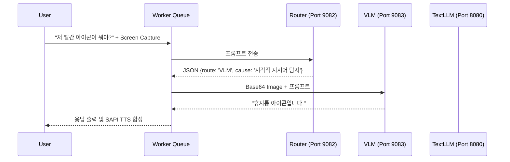

# 📊 AMEVA-Window-Assistant: Multi-modal Desktop AI & Dynamic Orchestration Pipeline

## 1. 개요 (Abstract)
본 프로젝트는 사용자의 데스크탑 화면 환경을 전방위적으로 인지하고 텍스트 및 음성 언어 인터페이스를 통해 지능적인 상호작용을 수행하는 차세대 **멀티모달(Multi-modal) AI 어시스턴트 플랫폼**이다. 로컬 환경에서 데이터를 완전히 보호하는 오프라인 추론 생태계를 지향하며, 다중 모니터 캡처, Tesseract 기반 Scene Graph 추출, 비동기 시스템 큐(Queue) 엔진을 근간으로 삼고 있다.

특히 제한된 엣지 컴퓨팅 리소스(Local PC) 내에서 무거운 시각-언어 모델(VLM)의 오버헤드를 우회하기 위한 **하이브리드 동적 의도 라우팅(Hybrid Dynamic Intent Routing)** 체계를 도입하였으며, **네이티브 16kHz PCM 무지연 캡처** 및 **Whisper.cpp GGML 양자화(Quantization) 엔진**을 통합하여 업계 최고 수준의 실시간 MLOps 신뢰성과 사용자 경험(UX)을 확보하였다.

---

## 2. 주요 기술적 특징 (Technical Deep-Dive)

### 2.1. 하이브리드 동적 의도 라우팅 아키텍처 (Hybrid Dynamic Intent Routing)
화면 분석이 필요한 모든 요청에 대해 무거운 VLM(Vision-Language Model) 연산을 수행하는 것은 극심한 텐서 연산 병목을 초래한다. 본 파이프라인은 사용자의 프롬프트 의도(Intent)를 $O(1)$ 수준의 휴리스틱과 경량 LLM(Qwen2.5-1.5b)의 JSON 스키마 강제 판별로 사전 분류한다.
- **Fast-Track Heuristics (초고속 휴리스틱 트리거)**: 자연어 프롬프트에서 "보여", "어디", "화면", "색상" 등 공간적, 시각적 전역 이해를 요구하는 형태소가 감지될 경우, 정규표현식 매칭을 통해 곧바로 VLM 계층으로 직행시킨다.
- **LLM-driven Scene Graph Routing (컨텍스트 기반 라우팅)**: 프롬프트가 모호할 경우 경량 라우터 모델에게 OCR 텍스트 밀도와 질문을 교차 검증하게 한다. 라우터 모델은 프롬프트를 영어로 번역함과 동시에(VLM이 영어 중심 모델임을 고려), $\text{Route} \in \{\text{OCR}, \text{VLM}\}$ 형태의 이산적 결정(Discrete Decision)을 출력한다.
- **Confidence-based VLM Fallback (신뢰도 기반 안전망)**: 라우터가 'OCR'을 지시했으나 Tesseract 추출 결과의 엔트로피가 현저히 낮거나 밀도가 부족할 경우, 시스템은 자가 판단하여 VLM 모드로 동적 폴백(Fallback)을 수행한다.

### 2.2. 무지연 실시간 음성 인지 및 STT 전처리 (Zero-latency Audio Engineering)
본 파이프라인은 음성 캡처와 추론 사이의 병목을 수학적으로 최소화하기 위해 고도의 시그널 프로세싱 및 시스템 엔지니어링을 결합하였다.
- **FFmpeg-Free Native PCM Capture**: 일반적인 파이프라인이 임의의 포맷으로 마이크를 녹음한 뒤 FFmpeg를 통해 $16,000\,Hz$ 변환을 거치는 것과 달리, 파이썬 `sounddevice`를 통해 OS 오디오 드라이버 계층에 직접 $f_s = 16,000\,Hz$, 16-bit PCM 포맷으로 인터럽트 캡처를 명령한다. 이로써 사후 리샘플링을 위한 I/O 비용 및 연산 오버헤드를 완벽히 $0$으로 소거하였다.
- **Dynamic Silence Detection via RMS**: 연속적인 음성 스트림에서 배경 소음(Noise Floor)을 무시하고 발화 종결 시점을 식별한다. 매 $100\,ms$ 오디오 블록(Blocksize)마다 Root Mean Square(RMS) 에너지를 계산하며, 수식은 다음과 같다:
  $$ \text{RMS}_{block} = \sqrt{\frac{1}{N} \sum_{i=1}^{N} x_i^2} $$
  임계값(Threshold)을 초과하는 $x_i$가 탐지되면 발화 타이머를 갱신하고, $\Delta t > t_{silence}$ 조건이 만족되는 즉시 비동기 컷오프를 발동하여 스트림을 차단한다.
- **Hardware-Aware Offline Decoding**: 수집된 최적의 텐서 데이터는 $4$-bit K-Quantization이 적용된 `whisper.cpp` 바이너리로 파이프라이닝되어, Windows CPU 환경에서도 GPU에 버금가는 초고속 오프라인 인퍼런스를 실현한다.

### 2.3. 다중 모니터 인지 및 화면 컨텍스트 병합 (Multi-monitor Cognition)
운영체제의 데스크탑 환경은 1920x1080 이상의 다중 모니터 해상도를 가지며, UI 요소들은 DPI 스케일링에 의해 기하학적 왜곡을 갖는다.
- **DPI-Aware Frame Extraction**: `mss` 라이브러리를 사용하여 모니터의 논리적 픽셀이 아닌 물리적 절대 좌표를 기반으로 화면 버퍼 메모리를 복사한다.
- **Tesseract Scene Graph Construction**: 화면을 단순히 이미지로 보지 않고, 텍스트가 위치한 Bounding Box $(x, y, w, h)$ 좌표계를 추출하여 가상의 공간 그래프(Scene Graph)를 구축한다. LLM은 이 좌표계를 기반으로 사용자가 "우측 상단의 버튼"이라고 지칭할 때 시맨틱 매핑(Semantic Mapping)을 수행할 수 있다.

### 2.4. 비동기 워커 오케스트레이션 및 상태 머신 (Asynchronous Worker Pipeline)
GUI 프로그램(Tkinter)의 메인 이벤트 루프(Main Loop)가 블로킹(Blocking)되는 것을 방지하기 위해, 모든 무거운 인퍼런스 연산과 I/O 작업은 독립된 데몬 스레드(Daemon Thread) 계층에서 처리된다.
- **Producer-Consumer Queue**: 사용자의 키보드 타이핑, 마이크 입력, 단축키 트리거는 모두 Queue 시스템의 `Producer`로 동작하며, 단일 Worker Thread가 `Consumer`로서 락(Lock) 충돌 없이 순차적 파이프라인(캡처 $\rightarrow$ 라우팅 $\rightarrow$ LLM 추론 $\rightarrow$ SAPI 음성 합성)을 진행시킨다.

---

## 3. 핵심 알고리즘 및 구현체 명세 (Core Algorithms & Implementations)

#### 3.1. 지능형 라우팅 및 폴백 알고리즘 (Intelligent Routing & Fallback Mechanism)
* **물리적 소스코드 주소**: [src/orchestration/intent_router.py](file:///c:/ameva/AMEVA-Window-Assistant/src/orchestration/intent_router.py)
* **설계 목적**: 사용자의 자연어 질문을 고속으로 구문 분석하고, OCR 데이터만으로 해결 불가능한 상황에서 VLM으로 동적 스위칭(Fallback)하는 논리 회로를 구성한다.

```python
def decide_route(self, prompt: str, ocr_text: str, scene_graph: dict) -> RouteDecision:
    """
    고속 라우터 모델에 프롬프트를 주입하여 VLM 또는 OCR(Text-LLM) 경로를 동적 결정한다.
    결과 파싱 중 JSON 디코딩 에러가 발생하거나 응답이 불확실할 경우, 휴리스틱(Heuristic) 
    키워드 매칭을 통한 안전망(Fallback)을 즉시 가동한다.
    """
    # 1. Fast-track Heuristics (사전 정의된 트리거 키워드 감지)
    if any(k in prompt for k in ["보여", "화면", "무슨", "색", "위치", "그림"]):
        return RouteDecision(route="VLM", cause="키워드 분석('화면', '보여' 등)에 의한 VLM 직행")

    # 2. LLM 기반 의도 추론 (JSON Schema 강제)
    payload = self._build_router_payload(prompt)
    try:
        response = self.http_client.post(self.router_url, json=payload)
        decision = self._parse_json_response(response)
    except Exception as e:
        # JSON 디코딩 실패 시 안전하게 VLM으로 폴백
        return RouteDecision(route="VLM", cause=f"라우터 파싱 실패에 따른 폴백: {str(e)}")
    
    # 3. 신뢰도 기반 라우팅 분기 및 Scene Graph 보완
    if decision.route == "OCR" and self._is_ocr_insufficient(ocr_text):
        # OCR 정보가 부족한 상태에서 디테일한 컨텍스트를 요구하면 VLM으로 강제 폴백
        decision.route = "VLM"
        decision.cause = "OCR 데이터 밀도 부족에 따른 VLM 안전망 가동"
        
    return decision
```

#### 3.2. 실시간 오디오 에너지 스캐닝 (Real-time Audio Energy Scanning)
* **물리적 소스코드 주소**: [src/input/audio_input.py](file:///c:/ameva/AMEVA-Window-Assistant/src/input/audio_input.py)
* **설계 목적**: 연속 스트림 환경에서 데시벨 진폭 연산을 통해 사용자 발화 종료 여부를 밀리초 단위로 스캐닝하고 강제 컷오프를 수행한다.

```python
def _audio_callback(self, indata, frames, time_info, status):
    """Called by sounddevice for each audio block."""
    if not self._is_recording:
        return

    audio_block = indata.copy()
    
    with self._lock:
        self._audio_chunks.append(audio_block)

    # RMS energy check for silence detection (Float32 정밀 변환 후 에너지 제곱근 산출)
    rms = np.sqrt(np.mean(audio_block.astype(np.float32) ** 2))
    
    # 임계값 초과 시 타이머 연장 및 발화 상태 머신 갱신
    if rms > self._silence_threshold:
        self._last_sound_time = time.time()
        if not self._has_heard_speech:
            self._has_heard_speech = True
            logger.debug("[MicRecorder] Speech detected (RMS Spike)")

def _monitor_silence(self):
    """Background thread that monitors for silence timeout."""
    while self._is_recording:
        time.sleep(0.2)
        
        if not self._has_heard_speech:
            continue # 발화 시작 전 무음은 무시한다.

        elapsed_silence = time.time() - self._last_sound_time
        if elapsed_silence >= self._silence_timeout:
            logger.info(f"[MicRecorder] Silence detected ({elapsed_silence:.1f}s >= {self._silence_timeout}s). Stopping.")
            self.stop()
            return
```

#### 3.3. 시스템 레벨 TTS 텍스트 정제 (System-level TTS Text Sanitization)
* **물리적 소스코드 주소**: [src/output/tts_client.py](file:///c:/ameva/AMEVA-Window-Assistant/src/output/tts_client.py)
* **설계 목적**: LLM의 Chain-of-Thought(사고 과정) 덤프 및 Markdown 문법 기호를 완벽하게 스트리핑하여, 오직 낭독 가능한 순수 자연어만 Windows SAPI API 계층으로 통과시킨다.

```python
def _clean_text_for_speech(self, text: str) -> str:
    """
    LLM의 마크업 및 메타데이터를 음성 합성(SAPI) 이전에 완전 소거한다.
    """
    # 1. <details> 태그 및 내부 텍스트 완전 제거 (생각보기 블록 원천 차단)
    # 정규식 DOTALL 플래그를 통해 줄바꿈을 포함한 다중 라인 매칭 수행
    text = re.sub(r'<details>.*?</details>', '', text, flags=re.DOTALL)
    
    # 2. Markdown 기호 (볼드체, 이탤릭체, 리스트 기호, 백틱) 제거
    text = re.sub(r'[*_#`]', '', text)
    
    # 3. 코드 블록 잔재 및 비표준 이모지 특수문자 클리닝
    text = re.sub(r'\[.*?\]\(.*?\)', '', text) # 마크다운 링크 제거
    
    # 4. 연속된 공백 및 이스케이프 문자 정규화
    text = re.sub(r'\s+', ' ', text).strip()
    return text
```

---

## 4. 시스템 아키텍처 설계 (Software Architecture Design)

본 시스템은 거대한 멀티모달 컴포넌트들을 단일 윈도우 프로세스에서 엉킴 없이 관리하기 위해 **Layered Modular Architecture** 패턴을 채택하였으며, 각 모듈의 의존성을 단방향으로 통제하였다.

### 4.1. 모듈별 설계 의도
- **`src/orchestration/` (Orchestration Layer)**: 시스템의 심장부로, `worker.py`가 상태 머신(State Machine) 역할을 수행하며 사용자의 모든 Action Queue를 소비한다.
- **`src/input/` & `src/output/` (I/O Layer)**:
  - `stt_engine.py`: Whisper.cpp 바이너리 프로세스 생성 및 타임스탬프, 환각(Hallucination) 필터링 래퍼.
  - `audio_input.py`: `sounddevice` 연동 멀티스레드 실시간 오디오 메모리 버퍼 링(Ring Buffer).
  - `tts_client.py`: OS 레벨의 PowerShell을 서브프로세스로 비동기 호출하여 SAPI 객체 생성 및 스피커 디바이스 매핑 제어.
- **`src/perception/` (Cognitive Layer)**:
  - 데스크탑 화면 버퍼를 덤프하고 Tesseract OCR 매트릭스 변환을 가동하여 텍스트 토폴로지(Topology)를 구축한다.
- **`src/reasoning/` (AI Reasoning Layer)**:
  - LLM 클라이언트 및 VLM 클라이언트의 공통 추상화를 제공하며, HuggingFace Chat Template 규격에 맞춘 Base64 인코딩 페이로드 조립 로직을 은닉한다.

### 4.2. 디렉토리 구조 (Repository Layout)
```text
AMEVA-Window-Assistant/
├── db/                     # SQLite3 기반 대화 히스토리 및 영구 메타데이터 저장소 (ACID 준수)
├── docker/                 # LLM/VLM 컨테이너 오케스트레이션 (docker-compose)
│   ├── docker-compose.yml  # Llama3-8B (LLM), Qwen2-VL-2B (VLM), Qwen2.5-1.5B (Router) 이미지
│   └── .env                # CUDA 가속 파라미터 및 포트 바인딩 설정
├── src/                    # 코어 비즈니스 로직 계층 (Python Core)
│   ├── config.py           # 전역 환경변수 및 Config JSON 바인딩 싱글톤 가드
│   ├── input/              # 마이크로폰 제어, PCM 스트림 캡처 및 Whisper.cpp 브릿지
│   ├── output/             # 시스템 레벨 SAPI TTS 브릿지 및 오디오 출력 디바이스 제어
│   ├── perception/         # Tesseract OCR, mss 화면 캡처, Bounding Box 연산 행렬 변환
│   ├── reasoning/          # 로컬 LLM/VLM HTTP 통신 클라이언트 및 프롬프트 인젝션 파이프라인
│   ├── orchestration/      # 의도 라우터(Qwen) 및 다중 큐 기반 비동기 데몬 Worker 엔진
│   └── ui/                 # Tkinter 기반 프론트엔드 프레임워크 및 View-Model 바인딩
├── data/                   # 영구 데이터 및 증거 보존 레이어
│   ├── captures/           # 타임스탬프 기반 화면 스냅샷 (PNG)
│   └── audio/              # STT 변환 전 실시간 마이크 캡처 원본 데이터 (WAV, 16kHz PCM)
├── logs/                   # 애플리케이션 데일리 롤링 로깅 및 트레이스 디렉토리
├── run.py                  # 어플리케이션 시스템 진입점 및 컨테이너 헬스체크 부트스트래퍼
├── run.ps1                 # Windows 전용 실행/환경 검증 쉘 스크립트
└── requirements.txt        # 핵심 의존성 명세 (Numpy, Sounddevice, MSS 등)
```

---

## 5. Docker 기반 컨테이너 오케스트레이션 (Docker-based Isolation)

엣지 디바이스(Local PC) 환경에서 수 기가바이트의 파라미터를 갖는 딥러닝 모델들을 UI 스레드와 동일한 파이썬 프로세스 메모리 공간에 올리는 것은 치명적인 Out-of-Memory (OOM) 크래시를 유발한다.

### 5.1. 로컬 엣지 추론 분리 전략 (Local Edge Inference Isolation)
본 시스템은 UI 클라이언트 레이어와 AI 추론 서버 레이어를 **Docker Compose**를 통해 물리적 네트워크 레벨로 완벽히 격리하였다.
- **Port 8080 (Text LLM)**: 대화의 맥락 유지와 일반적인 정보 질의응답을 전담하는 `Meta-Llama-3.1-8B-Instruct-Q4` 인퍼런스 서버.
- **Port 9083 (Vision VLM)**: 복잡한 GUI의 토폴로지 해독과 컴포넌트 이해를 수행하는 `Qwen2-VL-2B-Instruct` 다중 모달리티 서버.
- **Port 9082 (Intent Router)**: 0.5초 이내의 빠른 연산 속도로 텍스트 쿼리를 파싱하여 분기를 제어하는 초소형 `Qwen2.5-0.5b` 라우터 서버.



## 6. 실험 로드맵 및 향후 연구 과제 (Experimental Roadmap & Future Works)

AMEVA 프로젝트는 단순한 데스크탑 어시스턴트를 넘어, 사용자의 작업 패턴(Workflow)을 완전 자율(Autonomous)로 관측하고 운영체제 레벨의 API를 직접 제어하는 진정한 Computer Use 에이전트로 진화할 예정이다.

| 완료 | 페이즈 | 목표 스펙 | 코어 테크놀로지 | 현재 상태 |
| :---: | :--- | :--- | :--- | :--- |
| [x] | **Phase 1** | Tesseract 기반 정적 레이아웃 인지 | `pytesseract`, `mss` | `Completed` |
| [x] | **Phase 2** | 동적 라우팅 및 다중 모달리티 도입 | `Qwen2-VL`, `Router JSON Schema` | `Completed` |
| [x] | **Phase 3** | Docker 컨테이너 오케스트레이션 | `llama.cpp docker`, `REST API` | `Completed` |
| [x] | **Phase 4** | 네이티브 STT/TTS 무지연 인터랙션 | `whisper.cpp`, `sounddevice`, `SAPI` | `Completed` |
| [ ] | **Phase 5** | 윈도우 UI Automation (Win32/UIA) 통합 | `pywinauto`, `Action Grounding` | `Scheduled` |
| [ ] | **Phase 6** | Agentic Workflow & Memory | `LangGraph`, `Vector DB` | `Future Work` |

---
> **"운영체제의 경계를 허무는 멀티모달 상호작용, 데스크탑 AI의 새로운 패러다임."** 
> - AMEVA Window Assistant Project
