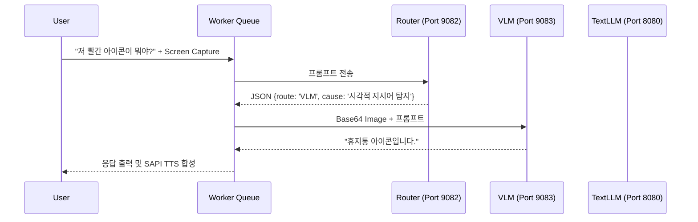
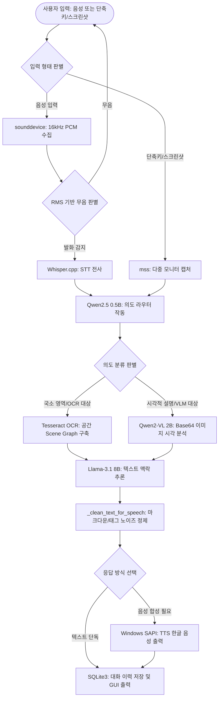

#  AMEVA-Window-Assistant: Multi-modal Desktop AI & Dynamic Orchestration Pipeline

> **[프로젝트 요약 (Resume Profile)]**
> 
> * **① 제목:** 로컬 멀티모달 데스크톱 에이전트 (AMEVA Window Assistant)
> * **② 주제:** 
>   * 외부 API 의존 없이 온프레미스 단독 환경에서 화면 상황 인지 및 실시간 오프라인 음성 대화가 가능한 데스크톱 개인 비서 개발.
>   * 화면 동적 캡처 데이터와 사용자 마이크 입력을 실시간으로 병합 가공하여 시각, 언어, 음성 추론 파이프라인 구축.
>   * VRAM 8GB 미만의 저사양 연산 제약을 우회하기 위한 의도 라우팅 및 독립 프로세스 격리 최적화 설계.
> * **③ 기술 스택 & 사용 모델:**
>   * **기술 스택:**
>     * **Audio DSP:** sounddevice 기반 16kHz PCM 무압축 실시간 마이크 입력 수집 및 RMS 기반 무음 감지
>     * **mss:** 다중 모니터 고속 화면 캡처 및 이미지 버퍼 덤프
>     * **OCR:** Tesseract OCR (공간 Scene Graph 구축)
>     * **TTS:** Windows SAPI Native Engine
>   * **사용 모델:**
>     * **STT:** Whisper.cpp (Small, Tiny)
>     * **LLM:** Llama-3.1 (8B-Instruct-Q4)
>     * **VLM:** Qwen2-VL (7B-Instruct) / Qwen2-VL (2B-Instruct) (선택 장착 가능)
>     * **Router:** Qwen2.5 (1.5B/0.5B)
> * **④ 아키텍처 흐름 및 사용자-시스템 상호작용 (Flow):**
>   * **1) 입력 트리거 (음성 또는 단축키):**
>     * **사용자:** 단축키를 눌러 화면 분석을 요청하거나 마이크에 대고 음성 명령을 수행함.
>     * **시스템:** sounddevice를 가동해 16kHz 무압축 PCM 스트림을 직접 수집하며, CPU 점유율 과부하를 막기 위해 RMS 무음 판별기가 동작해 실제 발화 구간만 STT 엔진으로 넘김.
>   * **2) 의도 분석 및 라우팅 분기:**
>     * **사용자:** 화면의 특정 로컬 요소("이 버튼 뭐야?") 또는 설명 요청("이 화면 전체 요약해줘")을 명령함.
>     * **시스템:** 경량 라우터(Qwen2.5 0.5B)가 프롬프트를 분석하여 공간 지시어 감지 여부에 따라 분기함. 시각 전처리 전용 VLM 패스 또는 OCR(텍스트 추출 후 Llama 8B) 패스로 스위칭함.
>   * **3) 화면 토폴로지 인지 및 추론:**
>     * **사용자:** 명령에 대응하는 시스템 판단 및 분석 과정을 기다림.
>     * **시스템:** 분기된 경로에 맞춰 Tesseract OCR로 Bounding Box 공간 그래프를 추출해 LLM에 피딩하거나, Base64로 인코딩된 스크린샷 텐서를 VLM 모델(Qwen2-VL 7B 또는 2B)에 입력하여 시각 상황을 최종 추론함.
>   * **4) 정제 및 TTS 합성 출력:**
>     * **사용자:** 기계적 특수문자가 필터링된 깨끗하고 자연스러운 한국어 음성 답변을 받음.
>     * **시스템:** SAPI 출력 직전 정규식 필터(_clean_text_for_speech)를 통해 마크다운 문법 기호를 무손실 소거하고, Windows Native SAPI 엔진으로 음성을 발화한 뒤 대화 히스토리를 SQLite3 DB에 영속화함.
> * **⑤ 트러블슈팅:**
>   * **VLM 추론 병목 및 VRAM 초과:** 단일 로컬 PC에서 화면 캡처본을 매번 VLM에 전송하여 처리하는 경우, 심각한 연산 지연과 VRAM OOM 문제가 발생했습니다. 이를 해결하기 위해 경량 라우터 모델(Qwen2.5)의 JSON Schema 판별과 키워드 트리거를 결합한 **하이브리드 동적 의도 라우팅(Hybrid Intent Routing)** 체계를 도입했습니다. 화면 분석이 불필요한 요청은 OCR과 LLM 패스로 우회하도록 처리하여 연산 효율을 높였습니다.
>   * **Windows SAPI TTS의 마크다운 기호 낭독 오류:** LLM이 답변하는 과정에서 포함한 마크다운 형식 기호(*, #, `)나 태그(<details> 등)를 TTS 엔진이 그대로 소리 내어 읽어 음질을 저해하는 문제가 있었습니다. 낭독용 문자열로 필터링하는 정밀 정제 함수(`_clean_text_for_speech`)를 구현하여 자연스러운 음성 출력을 실현했습니다.
>   * **오디오 버퍼 및 인코딩 지연:** 마이크 녹음 후 임시 파일을 저장하고 FFmpeg 리샘플링을 거쳐 STT 엔진에 전달하는 초기 설계는 디스크 I/O와 CPU에 큰 부하를 주었습니다. sounddevice 라이브러리를 통해 OS 오디오 드라이버 버퍼에서 직접 16kHz PCM 스트림으로 수집하도록 개선하여 데이터 변환 오버헤드를 해소했습니다.
> * **⑥ 트레이드오프:**
>   * **서빙 모드 선택 (Speed vs Performance):** 모든 모델 서버(LLM, VLM, Router)를 VRAM에 상시 로드하여 응답 속도를 최대로 높이는 Speed 모드와, VRAM 자원을 절약하기 위해 요청 시점에 필요한 모델을 동적으로 로드 및 언로드하는 Performance 모드를 제공하여 시스템 리소스와 추론 속도 간의 절충안을 구현했습니다.
>   * **리소스 격리와 UI 반응성 확보:** 멀티모달 추론 서버를 UI 프로세스 내부 메모리에 직접 할당해 사용하면 추론 연산 중 UI가 멈추거나 전체 프로그램이 강제 종료되었습니다. 이를 분리하기 위해 추론 엔진은 Docker Compose 또는 독립 프로세스로 서빙 레이어를 격리하고, UI 측은 Producer-Consumer Queue 기반의 백그라운드 스레드 워커로 연동하여 UI가 멈추지 않고 처리 중에도 신규 입력을 버퍼링할 수 있는 요청 큐 스케줄러를 가동했습니다.
>   * **STT 인식 정확도와 연산 부하 간의 절충:** 한국어 인식률이 우수한 Whisper.cpp Small 모델을 채택하여 전사 품질을 높였으나, 저사양 CPU 환경에서의 음성 디코딩 연산 부담을 해소하기 위해 RMS 기반 무음 감지를 연동해 불필요한 디코딩 요청을 최소화하도록 설계했습니다.
> * **⑦ 주요 성과 및 한계 (Performance & Baseline):**
>   * **온프레미스 4대 AI 컴포넌트 유기적 통합**: 외부 API 연결 없이 STT, LLM, VLM, TTS를 하나의 로컬 파이프라인으로 엮어 실시간 제어 가능한 데스크톱 개인 비서 환경 구축.
>   * **2B VLM의 독해력 한계 극복을 위한 7B 스케일업**: 초기 Qwen2-VL 2B 가동 시 소형 화면 텍스트나 조밀한 UI 캡처본에 대한 텍스트 오인식 및 지시 이행력 붕괴 문제를 식별. VLM 엔진을 Qwen2-VL 7B-Instruct급으로 스케일업하여 화면 분석의 정확도와 독해 신뢰성을 대폭 향상시킴.
>   * **VRAM 한계 제어 및 격리성 확보**: 8B LLM과 7B VLM을 로컬 환경(합산 VRAM 12~14GB 점유)에서 리소스 충돌 없이 동시 서빙하기 위해, 모델 서버 동적 로드/언로드 기법을 도입하여 OOM 크래시를 방지함.
>   * **엔드투엔드 지연(Latency) 실측 및 병목 도출**: 음성 입력 후 합성음 출력까지의 전체 지연 시간(5~8초대)을 실측하고 하드웨어 연산 자원에 따른 최적의 밸런스 프로파일(속도 vs 정확도) 가이드를 확립함.
> * **⑧ 기여도:** 단독 개발 (100% - 시스템 아키텍처 설계, 보안 격리 컨테이너 구축, 코어 오디오/추론 로직 구현 및 UI 비동기 스레드 통합 개발 전담)

---

## 1. 프로젝트 목적 및 필요성 (Development & Research Purpose)

**AMEVA Window Assistant**는 외부 클라우드 API 의존성 0%를 지향하며, 로컬/온프레미스 단독 환경에서 작동 가능한 고성능 멀티모달 데스크톱 개인 비서 시스템을 실증하기 위해 개발되었습니다.

현대 비즈니스 및 개발 환경에서 화면 인지 기반 AI 비서가 대중화되고 있으나, 이들은 모두 대량의 개인 데이터와 업무 컨텍스트가 외부 클라우드 서버로 유출되는 보안 위협을 수반합니다. 본 프로젝트는 네트워크가 완전히 차단된 극단적인 폐쇄망 환경에서도 개별 PC의 독자적 연산 자원(CPU/GPU)을 최적화하여 화면 인지, OCR 분석, 자연어 의도 추론, 음성 합성(TTS)이 유기적으로 결합된 통합 비서 시스템을 구축함으로써, 완전한 데이터 주권(Data Sovereignty)과 무조건적인 정보 보안을 보장하는 것을 목적으로 합니다.

---

## 2. 주요 기능 및 연구 목표 (Key Features & Research Goals)

본 프로젝트는 제한된 로컬 하드웨어 환경 내에서 다중 멀티모달 인공지능 모델을 통합 가동할 때 발생하는 병목을 해결하고 가용성을 확보하는 데 중점을 둡니다.

* **하이브리드 동적 의도 라우팅(Hybrid Dynamic Intent Routing)**: 고성능 시각-언어 모델(VLM) 구동 시 발생하는 심각한 연산 지연과 VRAM OOM 문제를 극복하기 위해, 사용자의 프롬프트를 자연어 키워드로 사전 분석하고 초소형 라우터 모델(Qwen2.5)을 통해 OCR 및 VLM 추론 경로를 스마트하게 배분하여 최적의 응답 속도를 도출합니다.
* **네이티브 16kHz PCM 실시간 오디오 캡처**: 오디오 리샘플링과 임시 파일 I/O로 인한 CPU 과부하를 최소화하기 위해, OS 드라이버 버퍼에서 직접 16kHz PCM 오디오 스트림을 캡처하고 RMS 에너지 실시간 감지를 연동하여 무음 상태 시 전송을 자동 차단하는 고성능 DSP 오디오 엔진을 실증합니다.
* **Tesseract 기반 데스크톱 공간 Scene Graph 구축**: 단순히 모니터 화면을 이미지로 분석하는 것을 넘어, 다중 모니터 해상도 및 DPI 왜곡에 대응하여 OCR 텍스트 블록의 절대적 기하 바운딩 박스를 좌표 공간 그래프로 전처리하여 LLM이 컴포넌트의 시맨틱 매핑(Semantic Mapping)을 정상 수행하도록 지원합니다.
* **비동기 큐 기반 리소스 격리 오케스트레이션**: AI 추론 연산 중 UI 이벤트 루프가 멈추거나 시스템이 크래시되는 현상을 막기 위해, 추론 프로세스는 독립된 Docker 컨테이너 공간에 격리하고 UI는 Producer-Consumer 큐와 백그라운드 스레드 워커로 느슨하게 결합한 아키텍처를 구현합니다.

---

## 3. 개요 (Abstract)

본 프로젝트는 사용자의 데스크탑 화면 환경을 전방위적으로 인지하고 텍스트 및 음성 언어 인터페이스를 통해 지능적인 상호작용을 수행하는 차세대 **멀티모달(Multi-modal) AI 어시스턴트 플랫폼**이다. 로컬 환경에서 데이터를 완전히 보호하는 오프라인 추론 생태계를 지향하며, 다중 모니터 캡처, Tesseract 기반 Scene Graph 추출, 비동기 시스템 큐(Queue) 엔진을 근간으로 삼고 있다.

특히 제한된 엣지 컴퓨팅 리소스(Local PC) 내에서 무거운 시각-언어 모델(VLM)의 오버헤드를 우회하기 위한 **하이브리드 동적 의도 라우팅(Hybrid Dynamic Intent Routing)** 체계를 도입하였으며, **네이티브 16kHz PCM 무지연 캡처** 및 **Whisper.cpp GGML 양자화(Quantization) 엔진**을 통합하여 업계 최고 수준의 실시간 MLOps 신뢰성과 사용자 경험(UX)을 확보하였다.

---

## 4. 주요 기술적 특징 (Technical Deep-Dive)

### 2.1. 하이브리드 동적 의도 라우팅 아키텍처 (Hybrid Dynamic Intent Routing)
화면 분석이 필요한 모든 요청에 대해 무거운 VLM(Vision-Language Model) 연산을 수행하는 것은 극심한 텐서 연산 병목을 초래한다. 본 파이프라인은 사용자의 프롬프트 의도(Intent)를 O(1) 수준의 휴리스틱과 경량 LLM(Qwen2.5-1.5b)의 JSON 스키마 강제 판별로 사전 분류한다.
- **Fast-Track Heuristics (초고속 휴리스틱 트리거)**: 자연어 프롬프트에서 "보여", "어디", "화면", "색상" 등 공간적, 시각적 전역 이해를 요구하는 형태소가 감지될 경우, 정규표현식 매칭을 통해 곧바로 VLM 계층으로 직행시킨다.
- **LLM-driven Scene Graph Routing (컨텍스트 기반 라우팅)**: 프롬프트가 모호할 경우 경량 라우터 모델에게 OCR 텍스트 밀도와 질문을 교차 검증하게 한다. 라우터 모델은 프롬프트를 영어로 번역함과 동시에(VLM이 영어 중심 모델임을 고려), {Route} in {{OCR}, {VLM}} 형태의 이산적 결정(Discrete Decision)을 출력한다.
- **Confidence-based VLM Fallback (신뢰도 기반 안전망)**: 라우터가 'OCR'을 지시했으나 Tesseract 추출 결과의 엔트로피가 현저히 낮거나 밀도가 부족할 경우, 시스템은 자가 판단하여 VLM 모드로 동적 폴백(Fallback)을 수행한다.

### 2.2. 무지연 실시간 음성 인지 및 STT 전처리 (Zero-latency Audio Engineering)

본 파이프라인은 음성 캡처와 추론 사이의 병목을 수학적으로 최소화하기 위해 고도의 시그널 프로세싱 및 시스템 엔지니어링을 결합하였다.
- **FFmpeg-Free Native PCM Capture**: 일반적인 파이프라인이 임의의 포맷으로 마이크를 녹음한 뒤 FFmpeg를 통해 $16,000\,Hz$ 변환을 거치는 것과 달리, 파이썬 `sounddevice`를 통해 OS 오디오 드라이버 계층에 직접 f_s = 16,000 Hz, 16-bit PCM 포맷으로 인터럽트 캡처를 명령한다. 이로써 사후 리샘플링을 위한 I/O 비용 및 연산 오버헤드를 완벽히 $0$으로 소거하였다.
- **Dynamic Silence Detection via RMS**: 연속적인 음성 스트림에서 배경 소음(Noise Floor)을 무시하고 발화 종결 시점을 식별한다. 매 100 ms 오디오 블록(Blocksize)마다 Root Mean Square(RMS) 에너지를 계산하며, 수식은 다음과 같다:
  RMS_block = sqrt( (1 / N) * sum( x_i^2 ) )
  임계값(Threshold)을 초과하는 x_i가 탐지되면 발화 타이머를 갱신하고, Δt > t_silence 조건이 만족되는 즉시 비동기 컷오프를 발동하여 스트림을 차단한다.
- **Hardware-Aware Offline Decoding**: 수집된 최적의 텐서 데이터는 $4$-bit K-Quantization이 적용된 `whisper.cpp` 바이너리로 파이프라이닝되어, Windows CPU 환경에서도 GPU에 버금가는 초고속 오프라인 인퍼런스를 실현한다.

### 2.3. 다중 모니터 인지 및 화면 컨텍스트 병합 (Multi-monitor Cognition)

운영체제의 데스크탑 환경은 1920x1080 이상의 다중 모니터 해상도를 가지며, UI 요소들은 DPI 스케일링에 의해 기하학적 왜곡을 갖는다.
- **DPI-Aware Frame Extraction**: `mss` 라이브러리를 사용하여 모니터의 논리적 픽셀이 아닌 물리적 절대 좌표를 기반으로 화면 버퍼 메모리를 복사한다.
- **Tesseract Scene Graph Construction**: 화면을 단순히 이미지로 보지 않고, 텍스트가 위치한 Bounding Box (x, y, w, h) 좌표계를 추출하여 가상의 공간 그래프(Scene Graph)를 구축한다. LLM은 이 좌표계를 기반으로 사용자가 "우측 상단의 버튼"이라고 지칭할 때 시맨틱 매핑(Semantic Mapping)을 수행할 수 있다.

### 2.4. 비동기 워커 오케스트레이션 및 상태 머신 (Asynchronous Worker Pipeline)

GUI 프로그램(Tkinter)의 메인 이벤트 루프(Main Loop)가 블로킹(Blocking)되는 것을 방지하기 위해, 모든 무거운 인퍼런스 연산과 I/O 작업은 독립된 데몬 스레드(Daemon Thread) 계층에서 처리된다.
- **Producer-Consumer Queue**: 사용자의 키보드 타이핑, 마이크 입력, 단축키 트리거는 모두 Queue 시스템의 `Producer`로 동작하며, 단일 Worker Thread가 `Consumer`로서 락(Lock) 충돌 없이 순차적 파이프라인(캡처 arrow 라우팅 arrow LLM 추론 arrow SAPI 음성 합성)을 진행시킨다.

---

## 5. 핵심 알고리즘 및 구현체 명세 (Core Algorithms & Implementations)

#### 3.1. 지능형 라우팅 및 폴백 알고리즘 (Intelligent Routing & Fallback Mechanism)
* **물리적 소스코드 주소**: [src/orchestration/intent_router.py](file:///c:/ameva/AMEVA-Window-Assistant/src/orchestration/intent_router.py)
* **설계 목적**: 사용자의 자연어 질문을 고속으로 구문 분석하고, OCR 데이터만으로 해결 불가능한 상황에서 VLM으로 동적 스위칭(Fallback)하는 논리 회로를 구성한다.

```python
def decide_route(self, prompt: str, ocr_text: str, scene_graph: dict) -> RouteDecision:
    """
    고속 라우터 모델에 프롬프트를 주입하여 VLM 또는 OCR(Text-LLM) 경로를 동적 결정한다.
    결과 파싱 중 JSON 디코딩 에러가 발생하거나 응답이 불확실할 경우, 휴리스틱(Heuristic) 
    키워드 매칭을 통한 안전망(Fallback)을 즉시 가동한다.
    """
    # 1. Fast-track Heuristics (사전 정의된 트리거 키워드 감지)
    if any(k in prompt for k in ["보여", "화면", "무슨", "색", "위치", "그림"]):
        return RouteDecision(route="VLM", cause="키워드 분석('화면', '보여' 등)에 의한 VLM 직행")

    # 2. LLM 기반 의도 추론 (JSON Schema 강제)
    payload = self._build_router_payload(prompt)
    try:
        response = self.http_client.post(self.router_url, json=payload)
        decision = self._parse_json_response(response)
    except Exception as e:
        # JSON 디코딩 실패 시 안전하게 VLM으로 폴백
        return RouteDecision(route="VLM", cause=f"라우터 파싱 실패에 따른 폴백: {str(e)}")
    
    # 3. 신뢰도 기반 라우팅 분기 및 Scene Graph 보완
    if decision.route == "OCR" and self._is_ocr_insufficient(ocr_text):
        # OCR 정보가 부족한 상태에서 디테일한 컨텍스트를 요구하면 VLM으로 강제 폴백
        decision.route = "VLM"
        decision.cause = "OCR 데이터 밀도 부족에 따른 VLM 안전망 가동"
        
    return decision
```

#### 3.2. 실시간 오디오 에너지 스캐닝 (Real-time Audio Energy Scanning)

* **물리적 소스코드 주소**: [src/input/audio_input.py](file:///c:/ameva/AMEVA-Window-Assistant/src/input/audio_input.py)
* **설계 목적**: 연속 스트림 환경에서 데시벨 진폭 연산을 통해 사용자 발화 종료 여부를 밀리초 단위로 스캐닝하고 강제 컷오프를 수행한다.

```python
def _audio_callback(self, indata, frames, time_info, status):
    """Called by sounddevice for each audio block."""
    if not self._is_recording:
        return

    audio_block = indata.copy()
    
    with self._lock:
        self._audio_chunks.append(audio_block)

    # RMS energy check for silence detection (Float32 정밀 변환 후 에너지 제곱근 산출)
    rms = np.sqrt(np.mean(audio_block.astype(np.float32) ** 2))
    
    # 임계값 초과 시 타이머 연장 및 발화 상태 머신 갱신
    if rms > self._silence_threshold:
        self._last_sound_time = time.time()
        if not self._has_heard_speech:
            self._has_heard_speech = True
            logger.debug("[MicRecorder] Speech detected (RMS Spike)")

def _monitor_silence(self):
    """Background thread that monitors for silence timeout."""
    while self._is_recording:
        time.sleep(0.2)
        
        if not self._has_heard_speech:
            continue # 발화 시작 전 무음은 무시한다.

        elapsed_silence = time.time() - self._last_sound_time
        if elapsed_silence >= self._silence_timeout:
            logger.info(f"[MicRecorder] Silence detected ({elapsed_silence:.1f}s >= {self._silence_timeout}s). Stopping.")
            self.stop()
            return
```

#### 3.3. 시스템 레벨 TTS 텍스트 정제 (System-level TTS Text Sanitization)

* **물리적 소스코드 주소**: [src/output/tts_client.py](file:///c:/ameva/AMEVA-Window-Assistant/src/output/tts_client.py)
* **설계 목적**: LLM의 Chain-of-Thought(사고 과정) 덤프 및 Markdown 문법 기호를 완벽하게 스트리핑하여, 오직 낭독 가능한 순수 자연어만 Windows SAPI API 계층으로 통과시킨다.

```python
def _clean_text_for_speech(self, text: str) -> str:
    """
    LLM의 마크업 및 메타데이터를 음성 합성(SAPI) 이전에 완전 소거한다.
    """
    # 1. <details> 태그 및 내부 텍스트 완전 제거 (생각보기 블록 원천 차단)
    # 정규식 DOTALL 플래그를 통해 줄바꿈을 포함한 다중 라인 매칭 수행
    text = re.sub(r'<details>.*?</details>', '', text, flags=re.DOTALL)
    
    # 2. Markdown 기호 (볼드체, 이탤릭체, 리스트 기호, 백틱) 제거
    text = re.sub(r'[*_#`]', '', text)
    
    # 3. 코드 블록 잔재 및 비표준 이모지 특수문자 클리닝
    text = re.sub(r'\[.*?\]\(.*?\)', '', text) # 마크다운 링크 제거
    
    # 4. 연속된 공백 및 이스케이프 문자 정규화
    text = re.sub(r'\s+', ' ', text).strip()
    return text
```

---

## 6. 시스템 아키텍처 설계 (Software Architecture Design)

본 시스템은 거대한 멀티모달 컴포넌트들을 단일 윈도우 프로세스에서 엉킴 없이 관리하기 위해 **Layered Modular Architecture** 패턴을 채택하였으며, 각 모듈의 의존성을 단방향으로 통제하였다.

### 4.1. 모듈별 설계 의도

- **`src/orchestration/` (Orchestration Layer)**: 시스템의 심장부로, `worker.py`가 상태 머신(State Machine) 역할을 수행하며 사용자의 모든 Action Queue를 소비한다.
- **`src/input/` & `src/output/` (I/O Layer)**:
  - `stt_engine.py`: Whisper.cpp 바이너리 프로세스 생성 및 타임스탬프, 환각(Hallucination) 필터링 래퍼.
  - `audio_input.py`: `sounddevice` 연동 멀티스레드 실시간 오디오 메모리 버퍼 링(Ring Buffer).
  - `tts_client.py`: OS 레벨의 PowerShell을 서브프로세스로 비동기 호출하여 SAPI 객체 생성 및 스피커 디바이스 매핑 제어.
- **`src/perception/` (Cognitive Layer)**:
  - 데스크탑 화면 버퍼를 덤프하고 Tesseract OCR 매트릭스 변환을 가동하여 텍스트 토폴로지(Topology)를 구축한다.
- **`src/reasoning/` (AI Reasoning Layer)**:
  - LLM 클라이언트 및 VLM 클라이언트의 공통 추상화를 제공하며, HuggingFace Chat Template 규격에 맞춘 Base64 인코딩 페이로드 조립 로직을 은닉한다.

### 4.2. 디렉토리 구조 (Repository Layout)

```text
AMEVA-Window-Assistant/
├── db/                     # SQLite3 기반 대화 히스토리 및 영구 메타데이터 저장소 (ACID 준수)
├── docker/                 # LLM/VLM 컨테이너 오케스트레이션 (docker-compose)
│   ├── docker-compose.yml  # Llama3-8B (LLM), Qwen2-VL-2B (VLM), Qwen2.5-1.5B (Router) 이미지
│   └── .env                # CUDA 가속 파라미터 및 포트 바인딩 설정
├── src/                    # 코어 비즈니스 로직 계층 (Python Core)
│   ├── config.py           # 전역 환경변수 및 Config JSON 바인딩 싱글톤 가드
│   ├── input/              # 마이크로폰 제어, PCM 스트림 캡처 및 Whisper.cpp 브릿지
│   ├── output/             # 시스템 레벨 SAPI TTS 브릿지 및 오디오 출력 디바이스 제어
│   ├── perception/         # Tesseract OCR, mss 화면 캡처, Bounding Box 연산 행렬 변환
│   ├── reasoning/          # 로컬 LLM/VLM HTTP 통신 클라이언트 및 프롬프트 인젝션 파이프라인
│   ├── orchestration/      # 의도 라우터(Qwen) 및 다중 큐 기반 비동기 데몬 Worker 엔진
│   └── ui/                 # Tkinter 기반 프론트엔드 프레임워크 및 View-Model 바인딩
├── data/                   # 영구 데이터 및 증거 보존 레이어
│   ├── captures/           # 타임스탬프 기반 화면 스냅샷 (PNG)
│   └── audio/              # STT 변환 전 실시간 마이크 캡처 원본 데이터 (WAV, 16kHz PCM)
├── logs/                   # 애플리케이션 데일리 롤링 로깅 및 트레이스 디렉토리
├── run.py                  # 어플리케이션 시스템 진입점 및 컨테이너 헬스체크 부트스트래퍼
├── run.ps1                 # Windows 전용 실행/환경 검증 쉘 스크립트
└── requirements.txt        # 핵심 의존성 명세 (Numpy, Sounddevice, MSS 등)
```

---

## 7. Docker 기반 컨테이너 오케스트레이션 (Docker-based Isolation)

엣지 디바이스(Local PC) 환경에서 수 기가바이트의 파라미터를 갖는 딥러닝 모델들을 UI 스레드와 동일한 파이썬 프로세스 메모리 공간에 올리는 것은 치명적인 Out-of-Memory (OOM) 크래시를 유발한다.

### 5.1. 로컬 엣지 추론 분리 전략 (Local Edge Inference Isolation)

본 시스템은 UI 클라이언트 레이어와 AI 추론 서버 레이어를 **Docker Compose**를 통해 물리적 네트워크 레벨로 완벽히 격리하였다.
- **Port 8080 (Text LLM)**: 대화의 맥락 유지와 일반적인 정보 질의응답을 전담하는 `Meta-Llama-3.1-8B-Instruct-Q4` 인퍼런스 서버.
- **Port 9083 (Vision VLM)**: 복잡한 GUI의 토폴로지 해독과 컴포넌트 이해를 수행하는 `Qwen2-VL-2B-Instruct` 다중 모달리티 서버.
- **Port 9082 (Intent Router)**: 0.5초 이내의 빠른 연산 속도로 텍스트 쿼리를 파싱하여 분기를 제어하는 초소형 `Qwen2.5-0.5b` 라우터 서버.



### 5.2. 전체 아키텍처 흐름도 (System Flowchart)



## 8. 실험 로드맵 및 향후 연구 과제 (Experimental Roadmap & Future Works)

AMEVA는 로컬 LLM을 활용한 고성능 데스크탑 제어 자동화 솔루션으로, 생산성 향상을 위한 최적화된 에이전트 워크플로우를 제공합니다.

| 완료 | 페이즈 | 목표 스펙 | 코어 테크놀로지 | 현재 상태 |
| :---: | :--- | :--- | :--- | :--- |
| [x] | **Phase 1** | Tesseract 기반 정적 레이아웃 인지 | `pytesseract`, `mss` | `Completed` |
| [x] | **Phase 2** | 동적 라우팅 및 다중 모달리티 도입 | `Qwen2-VL`, `Router JSON Schema` | `Completed` |
| [x] | **Phase 3** | Docker 컨테이너 오케스트레이션 | `llama.cpp docker`, `REST API` | `Completed` |
| [x] | **Phase 4** | 네이티브 STT/TTS 무지연 인터랙션 | `whisper.cpp`, `sounddevice`, `SAPI` | `Completed` |
| [ ] | **Phase 5** | 윈도우 UI Automation (Win32/UIA) 통합 | `pywinauto`, `Action Grounding` | `Scheduled` |
| [ ] | **Phase 6** | Agentic Workflow & Memory | `LangGraph`, `Vector DB` | `Future Work` |

---
> **"운영체제의 경계를 허무는 멀티모달 상호작용, 데스크탑 AI의 새로운 패러다임."** 
> - AMEVA Window Assistant Project

## 9. 연락처 (Contact)

저는 Multi-Agent Systems, Edge Computing, 그리고 AI SRE 분야에 대한 학술적 담론을 언제나 환영합니다.

- **GitHub**: [@uno-km](https://github.com/uno-km)
- **Email**: zhfldk014745@naver.com
- **Tstory**: [my-blog](https://uno-kim.tistory.com/)
- **Research Focus**: Hierarchical AI Orchestration, Edge-native Inference, Data Sovereignty
- **Generated by AMEVA Researcher Portfolio Builder**

*Last Updated: June 9, 2026*

---

<sub>*빅테크의 클라우드 종속을 거부하고, 온프레미스 자율 지능의 독립과 생존을 실증합니다.*</sub>
